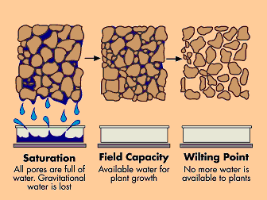

## GEE_UBM: Utah Soil Water Balance Model
GEE_UBM is a Python package for performing spatially distributed Soil Water Balance Utah Basin Model (UBM) calculations entirely within Google Earth Engine (GEE). It provides a standardized workflow to fetch hydrological datasets (Precipitation, Snowmelt, ET, Soil Properties), harmonize them to a common grid, and run various "Bucket Model" scenarios to estimate Recharge, Runoff, and Soil Moisture dynamics.

## 📦 Installation
Since this is currently a private repository, install it directly from GitHub:

```bash
pip install git+[https://github.com/radwinskis/GEE_UBM.git](https://github.com/radwinskis/GEE_UBM.git)
```

## Dependencies 
- `earthengine-api`
- `RadGEEToolbox` 
- `numpy`
- `pandas`

## Inputs for UBM model:

1) Max soil moisture (saturation volume)
    - Determined by soil porosity and thickness (available storage for water)
2) Wilting point
    - dryness level at which no more water is available to plants
3) Field capacity
    - amount of water retained by adhesion to grains and surface tension after gravity draining
4) Total soil moisture (T_soil_water)
    - instantaneous amount of water trapped in porous space of soil (?)
5) Hydraulic conductivity (K) of soil
    - rate at which fluid will flow through connected porous space
6) Available water
    - Precipitation and snow melt?
7) Evapotranspiration
    - Water lost from evaporation of soil moisture and vegetated transpiration



### **Physical / Lithology Assets**

Versions of:
- Soil Thickness
    - ISRIC asset
    - gNATSGO
- Porosity
    - UGS asset
    - HiHydroSoil
    - POLARIS
- Field Capacity
    - UGS asset
    - HiHydroSoil
    - OpenLandMap
- Wilting point
    - UGS asset
    - HiHydroSoil
- Hydraulic Conductivity
    - UGS BMC asset
    - UGS Geo K asset

### **Precipitation Collections**
- Dataset sources
    - PRISM (daily and monthly)
    - DAYMET (daily and monthly)
    - GRIDMET (daily and monthly)
    - CHIIRPS (daily and monthly)

The PRISM monthly (AN81m) dataset only goes up to the end of 2020. I will need to create my own monthly aggregation based on the daily precip dataset.

### **Snow-melt Collections**

Snowmelt datasets:
- ERA5 (daily and monthly)
- SMAP (daily and monthly aggregated)

Since SMAP snow melt data is ingested in three hour increments, the collection is MASSIVE. To handle this, I am exporting a daily aggregated version of the collection to an asset image collection to make future use of the data more managable and efficient. Only 3000 tasks are allowed at a time, so the export happens in two batches: 1) 2015-04-01 to 2022-12-31, and 2) 2023-01-01 to 2025-10-24 (last available SMAP date). The exported asset should already be masked to the Utah region but will need to double check.

### **Potential Evapotranspiration (PET) Collections**

PET data sources:
- GRIDMET (daily and monthly)
- ERA5 (daily and monthly)

### **Evapotranspiration (ET) Collections**

AET data sources:
- ERA5 (daily and monthly)
- MODIS (8-day and monthly)
- OpenET (monthly)
    - DisALEXI
    - Ensemble
    - PTJPL
    - SIMS
    - SSEBOP
    - EEMETRIC
    - GEESEBAL

### **Soil Moisture**

Soil moisture data sources:
- SMAP direct observations (daily and monthly)
- SMAP L4 model (daily and monthly)
- ERA5 (daily and monthly)
- GLDAS (daily and monthly)
- ECMWF (daily and monthly) **Forecast only - will only use if we do forecast models in the future**

**Instead of monthly sum aggregates, monthly soil moisture products grab the first image of each month as the starting condition**

## 🛠 Module Overview
### `InputCollections.py`
The "Data Factory". It allows string-based access to GEE assets without needing to memorize asset IDs.

Methods: `get_precip()`, `get_snowmelt()`, `get_PET()`, `get_AET()`, `get_soil_moisture()`, `get_static_raster()`.

Data Sources: PRISM, DAYMET, GRIDMET, CHIRPS, ERA5, SMAP, MODIS, OpenET, GLDAS.

### `helpers.py`
Contains the heavy-lifting spatial operations.

`harmonize_to_target()`: Intelligently resamples an image to match a target projection/scale.

`build_model_ready_collection()`: A robust, server-side loop that iterates through time-series collections, harmonizes them to the coarsest grid found, and attaches static soil properties to every image.

### `OriginalUBM.py` / `ModifiedUBM1.py` / `ModifiedUBM2.py`
Contain the ee.Image.iterate() logic for the specific model formulations. These models use ee.Image.where() logic to handle conditional branching (e.g., "If saturated, do X, else do Y") entirely on the server.

## ⚠️ Data Units & Conventions
- **Height/Depth:** All units are standardized to millimeters (mm) (e.g., Precip, Soil Thickness, SWE).

- **Time:** Models can run on Daily or Monthly time steps, provided the input collection is aggregated correctly via the Factory.

- **Projection:** The build_model_ready_collection function automatically detects the coarsest resolution among your inputs (usually ERA5 or SMAP) and projects all finer datasets (PRISM, etc.) to match that grid.

## UBM logic

#### Outline of Bucket Model
Essentially breaking down the cases where inputs > storage or when inputs < storage. Multiple scenarios when inputs < storage

___________________

#### List of inputs for original model
`soil porosity`, `soil thickness`, `field capacity`, `wilting point`, `bedrock hydraulic conductivuty (K; Geo K)`, `precipitation as water`, `snowmelt`, and `PET`

### <u> **Original UBM Model Workflow** - PET as Input</u>

1) `Available_Water = Precipitation + Snowmelt + Soil_Water_End_Of_Previous_Timestep`
    - Initial (first timestep) assumption: `Soil_Water_End_Of_Previous_Timestep = Field_Capacity`**

2) `Max_Soil_Moisture = Soil_Porosity * Soil_Thickness = Available_Void_Space`

3) `Availabile_Water_for_Recharge = Max_Soil_Moisture - Field_Capacity`

4) ### **`If (Available_Water > Max_Soil_Moisture)`**:
    - `AET = PET`
    - `Available_Water_for_Recharge = Max_Soil_Moisture - Field_Capacity`
    - `Recharge = min(Available_Water_for_Recharge, Geo_K)` - If the rock can take in all of the available water, it is all counted as recharge. If it can't, only the water it can take is counted as recharge. We will handle the leftover in the coming steps.
    - `Extra_Runoff = max(0, Available_Water_For_Recharge - Geo_K)` - Account for leftover/extra water if the rock can't take in all the available water. Use max() to avoid negative values and determine if there is extra water to be added to runoff, as runoff is determined by the soil properties rather than hydraulic conductivity.
    - `Runoff = Available_Water - Max_Soil_Moisture + Extra_runoff` 
    - `Water_In_Soil_End_of_Timestep = Available_Water - Runoff - Recharge - AET`

5) ### **`Elif (Available Water > Field Capacity)`**:
    - Enough water to fill porous voids but not force loss due to gravity. Will result in recharge and possibly runoff. 
    - `AET = PET`
    - `Available_Water_for_Recharge = Available_Water - Field_Capacity`
    - `Recharge = min(Available_Water_for_Recharge, Geo_K)` - Recharge is equal to whatever amount of water the rock can accept over the timestep. If the amount of water is smaller than the max amount rock can intake, the rock will intake all of it. If geo_K is smaller, all the rock can intake is geo_K over the timestep and some will be leftover remaining in the soil.
    - `Runoff = 0`
    - `Water_In_Soil_End_of_Timestep = Available_Water - Recharge - AET`

6) ### **`Elif (Available Water > Wilting Point)`**:
    - `AET = PET`
    - `Recharge = 0`
    - `Runoff = 0`
    - `Water_In_Soil_End_of_Timestep = Available_Water - AET`

7) ### **`Elif Available Water < Wilting Point`**:
    - `AET = 0`
    - `Recharge = 0`
    - `Runoff = 0`
    - `Water_In_Soil_End_of_Timestep = Available_Water`

8) ### `Water_In_Soil_End_of_Timestep = max(0, Water_In_Soil_End_of_Timestep)` 
    - This final step is to ensure the `Water_In_Soil_End_of_Timestep` value which will be used for the next timesteps calculation must be 0 or greater - if something wacky happens in the above calculation that makes the value go below zero. Debugging tool?

_________________________

#### **Modifications for updating models**
##### Instead of one model with 4 scenarios, I propose two additional models with three scenarios each to improve runoff and recharge estimates:

1) **Use AET as an input rather than output.** Calculates soil moisture based on the water balance, constrained by observed ET loss. It maintains internal mass consistency.
2) **Use AET and soil moisture as input.** Forces the soil moisture state to match observations at the start/end of each month. Uses observed ET to help calculate the runoff and recharge fluxes between those observed states.

_________________________

### <u>**Modified UBM Model 1 Workflow** - ET as Input</u> 👇👇👇

1) `Available_Water_Initial = Precipitation + Snowmelt + Soil_Water_End_Of_Previous_Timestep` - add up the input sources of water
    - For the first timestep, set the assumption: `Soil_Water_End_Of_Previous_Timestep = Field_Capacity` 

2) `Available_Water = Available_Water_Initial - min(AET, Available_Water_Initial)` - **KEY: subtract `AET` from input sources of water**, unless AET is larger then just say available water is NONE!
    - If AET is smaller than available water, AET will be subtracted from available water amounts. If it is larger, there is no water available and we make sure it is not a negative (physically impossible) value

3) `Max Soil Moisture = Soil Porosity * Soil Thickness = Available Void Space`

Now we bring in the if-else logic for the **three possible scenarios**

4) ### **`If (Available_Water > Max_Soil_Moisture)`**:
    - `Available_Water_For_Recharge = Max_Soil_Moisture - Field_Capacity`
    - `Recharge = min(Available_Water_For_Recharge, Geo_K)` - If the rock can take in all of the available water, it is all counted as recharge. If it can't, only the water it can take is counted as recharge. We will handle the leftover in the coming steps.
    - `Extra_runoff = max(0, Available_Water_For_Recharge - Geo_K)` - Account for leftover/extra water if the rock can't take in all the available water. Use max() to avoid negative values and determine if there is extra water to be added to runoff, as runoff is determined by the soil properties rather than hydraulic conductivity.
    - `Runoff = Available_Water - Max_Soil_Moisture + Extra_runoff` - Runoff is whatever the soil can't store in addition to whatever drainage waters the bedrock can't accept
    - `Water_In_Soil_End_of_Timestep = Field_Capacity` - This is the water stored in the soil following recharge and runoff. **`Water_In_Soil` will be carried over to the next timestep rather than act as an output, but this is a useful output regardless!** In this scenario, the soil is effectively saturated in water but no longer draining.

5) ### **`Else If (Available_Water > Field_Capacity)`**:
    - `Available_Water_for_recharge = Available_Water - Field_Capacity` - same as the first scenario
    - `Recharge = min(Available_Water_for_Recharge, Geo_K)` - Recharge is equal to whatever amount of water the rock can accept over the timestep. If the amount of water is smaller than the max amount rock can intake, the rock will intake all of it. If geo_K is smaller, all the rock can intake is geo_K over the timestep and some will be leftover remaining in the soil.
    - `Runoff = 0`
    - `Water_In_Soil_End_of_Timestep = Available_Water - Recharge` - Whatever water that was in the soil that was unable to get absorbed into the underlying bedrock over this timestep will remain in the soil. **`Water_In_Soil` will be carried over to the next timestep rather than act as an output, but this is a useful output regardless!**

6) ### **`Else If (Available_Water <= Field_Capacity)`**:
    - `Runoff = 0`
    - `Recharge = 0`
    - `Water_In_Soil_End_of_Timestep = Available_Water` - In this scenario, whatever water was available is within the limit of only being accepted by the soil through adhesion and trapping. No runoff or recharge possible.

7) ### `Water_In_Soil_End_of_Timestep = max(0, Water_In_Soil_End_of_Timestep)` 
    - This final step is to ensure the `Water_In_Soil_End_of_Timestep` value which will be used for the next timesteps calculation must be 0 or greater - if something wacky happens in the above calculation that makes the value go below zero. Debugging tool?


______________________________________

### <u>**Modified UBM Model 2 Workflow** - ET & Soil Moisture Data as Inputs</u> 👇👇👇

1) `Available_Water_Initial = Precipitation + Snowmelt + Soil_Water_Profile_Data_From_Beginning_of_Timestep` - add up the input sources of water, **KEY: this time using soil moisture information from observations or other models** instead of a water balance approach

2) `Available_Water = Available_Water_Initial - min(AET, Available_Water_Initial)` - **KEY: subtract `AET` from input sources of water**, unless AET is larger then just say available water is NONE!
    - If AET is smaller than available water, AET will be subtracted from available water amounts. If it is larger, there is no water available and we make sure it is not a negative (physically impossible) value

3) `Max Soil Moisture = Soil Porosity * Soil Thickness = Available Void Space`

Now we bring in the if-else logic for the **three possible scenarios**

4) ### **`If (Available_Water > Max_Soil_Moisture)`**:
    - `Available_Water_for_Recharge = Max_Soil_Moisture - Field_Capacity`
    - `Recharge = min(Available_Water_for_Recharge, Geo_K)` - If the rock can take in all of the available water, it is all counted as recharge. If it can't, only the water it can take is counted as recharge. We will handle the leftover in the coming steps.
    - `Extra_runoff = max(0, Available_Water_For_Recharge - Geo_K)` - Account for leftover/extra water if the rock can't take in all the available water. Use max() to avoid negative values and determine if there is extra water to be added to runoff, as runoff is determined by the soil properties rather than hydraulic conductivity.
    - `Runoff = Available_Water - Max_Soil_Moisture + Extra_runoff` - Runoff is whatever the soil can't store in addition to whatever drainage waters the bedrock can't accept

5) ### **`Else If (Available_Water > Field_Capacity)`**:
    - `Available_Water_for_Recharge = Available_Water - Field_Capacity`
    - `Recharge = min(Available_Water_for_Recharge, Geo_K)` - Recharge is equal to whatever amount of water the rock can accept over the timestep. If the amount of water is smaller than the max amount rock can intake, the rock will intake all of it. If geo_K is smaller, all the rock can intake is geo_K over the timestep and some will be leftover remaining in the soil.
    - `Runoff = 0`

6) ### **`Else If (Available_Water <= Field_Capacity)`**:
    - `Runoff = 0`
    - `Recharge = 0`

- *In this model, `Water_In_Soil_End_of_Timestep` is not reported or utilized. However, it may be useful to still calculate and store `Water_In_Soil_End_of_Timestep` to compare with `Soil_Water_Profile_Data_From_Beginning_of_Timestep` of the following timestep.*